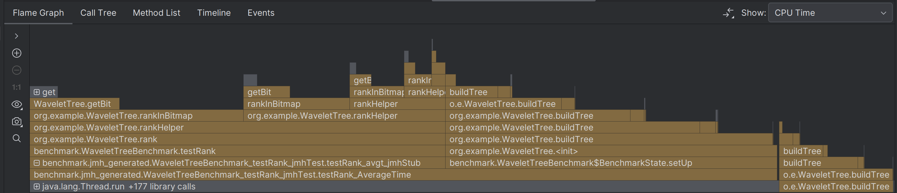
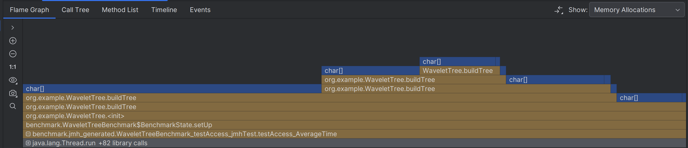
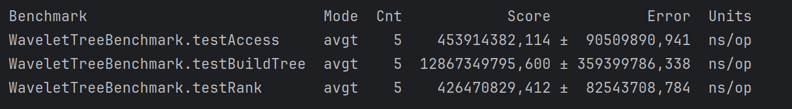

# Разработка структуры данных с внешней памятью
## Раздел: Работа с памятью в Java
## Описание:
В этой работе студентам предстоит реализовать одну из изученных ранее структур данных поиска с применением внешней памяти для Java, а также провести анализ производительности и оптимизацию, если потребуется.
___
## Внешняя память
Внешняя память — это ресурсы хранения данных, находящиеся за пределами оперативной памяти (RAM) вычислительной системы. К ним относятся, например, жёсткие диски (HDD), твердотельные накопители (SSD) или внешние хранилища (сетевые дисковые системы, облачные платформы). Основная отличительная черта внешней памяти заключается в том, что доступ к ней существенно медленнее и дороже по времени, чем к оперативной памяти. Чтение или запись данных, расположенных на диске, требует операций ввода-вывода (I/O), которые несопоставимо более длительны, чем операции доступа к RAM. В условиях обработки очень крупных массивов данных, зачастую не умещающихся целиком в оперативную память, возникает необходимость оптимизировать количество обращений к внешней памяти и минимизировать объёмы загружаемой информации.
___

## WaveletTree
В данной работе будет рассмотрена структура данных WaveletTree.
### Описание структуры
Wavelet Tree - структура данных, позволяющая эффективно работать со строками или последовательностями символов (чисел). Структура представляет собой дерево, в корне которого хранится информация о разделении всех символов на две группы.
На каждом уровне мы храним битовую последовательность (bitmap), где каждый бит показывает, куда пошёл символ (влево или вправо).  17569289232
Это помогает "спускаться" по дереву к нужному символу, быстро отслеживая его позицию.
### Основные операции
- Access - Быстрый поиск символа по индексу
- Rank - Подсчитать, сколько раз символ появляется до n-го вхождения символа
- Select - Поиск позиции по количеству вхождений
### Почему wavelet tree
Эта структура данных разбивает исходное множество символов по уровням, позволяя организовывать храниние битовых карт и вспомогательных структур в отдельных блоках или страницах.
Это облегчает частичную загрузку: чтобы ответить на запрос нет необходимости считать весь массив - достаточно считать данные с нескольких уровней дерева.
Так же внешняя память, лучше всего обрабатывается блочными операциями. Вайвлет-дерево позволяет разместить свои битовые карты.

Обычно глубина вайвлет-дерева находится в пределах O(log M), где M - размер алфавита, или O(log N), если рассматривать бинарные разбиения.

Вайвлет-дерево сочетается с техниками сжатия данных. Если битовые карты и вспомогательные структуры будут храниться в сжатом виде, то объем данных для чтения с диска при каждом запросе сокращается. 

## Проведение тестов
### Результаты бенчмарка

### Результаты профилировщика 
#### BUILD TREE
CPU Time

Получили, что наибольшее время уходит на buildTree.

Memory allocations

В целом, получил ожидаемые результаты. Большая часть использования памяти сосредоточена в методе buildTree.

CPU and Heap memory

#### Rank
CPU Time

Memory allocations

CPU and Heap memory

#### Access
CPU Time

Memory allocations

CPU and Heap memory

## Добавим батчи
### Результаты бенчмарка

Время acess и rank около-ожидаемо (для меня) уменьшилось, но не значительно
#### BUILD TREE
CPU Time

Memory allocations

CPU and Heap memory

#### Rank
CPU Time

Memory allocations

CPU and Heap memory

#### Access
CPU Time

Memory allocations

CPU and Heap memory

## Вывод
Реализован и протестирован Wavelet Tree, способный работать с большими объемами данных, которые превышают объем доступной оперативной памяти.
Использование MappedByteBuffer позволило сократить затраты на операции ввода-вывода и обеспечить эффективный доступ к данным на уровне страниц памяти.

В качестве оптимизации были внедрены батч-обработки данных, которые позволили минимизировать количество операций записи и чтения с диска.

В качестве дополнительной оптимизации можно было бы реализовать: распараллеливание для построения дерева, bit-parallel подход для ухода от линейного прохода по битам, succinct структуры данных (благо wavelet tree хорошо подходит для них),
двух (или более) уровневую индексацию.

